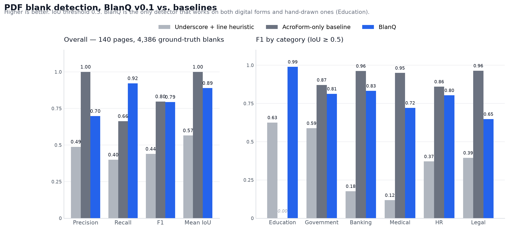

# blanq-benchmark

**The reference benchmark for PDF fillable-field detection.**

Not "a benchmark." *The* benchmark — public, reproducible, and built so anyone
can re-run every number in it. If you're evaluating tools that find blank
regions in PDFs (checkboxes, signature lines, multi-line answer boxes, table
cells...), this repo is meant to be the place you point to instead of a
marketing page.

> **Answer one question:** which tool detects fillable regions in arbitrary
> PDFs most accurately, fastest, and most reliably?
>
> Not OCR. Not "AI answering the form." Only blank detection.

## Status: v0.1, one real detector and two baselines scored

The dataset is 227 pages across 6 categories, with 4,386 ground-truth
blanks. Every page is a public-domain US government form (IRS, USCIS,
VA, CMS, USPTO, US Courts, CA Courts, CDPH) or an ESL worksheet I
reviewed by hand against BlanQ's detections. The full pipeline
(dataset, ground truth, detector, scoring, leaderboard) runs from a
clean checkout with four commands.



BlanQ ties the AcroForm-only baseline on overall F1 (0.79 vs 0.80) but
wins on recall (0.92 vs 0.66) and on coverage. The AcroForm baseline
gets those numbers by simply trusting the source PDF's own widget
metadata, and completely fails on the Education pages because those
worksheets have no widgets to read. BlanQ works on both cases. The
"underscore + line heuristic" baseline is what a 100-line Python
script can do without any ML.

BlanQ v0.1 numbers (`results/blanq/scores.json`):

| Metric                        | Value     |
|-------------------------------|-----------|
| Precision @ IoU 0.5           | 0.698     |
| Recall @ IoU 0.5              | 0.922     |
| F1 @ IoU 0.5                  | 0.794     |
| Mean IoU (matched)            | 0.889     |
| % blanks detected (IoU ≥ 0.5) | 92.2 %    |
| Mean detection time           | 911 ms/pg |
| Failure rate                  | 0 %       |

Where the ground truth comes from:

- 52 pages I reviewed by hand, mostly ESL worksheets with drawn
  underline blanks. I opened each page, looked at BlanQ's boxes, and
  approved the ones where the detection was right. On this subset
  alone BlanQ scores F1 = 0.971.
- 88 pages where the source PDF's own AcroForm widgets are the
  ground truth. Every fillable Text and ComboBox field the form
  designer marked counts as a blank. Exact by construction where it
  applies.
- 49 of those same AcroForm pages, extended with any BlanQ detection
  that (a) looks like an actual fill-in line rather than a checkbox:
  an elongated horizontal box at least 40pt wide, aspect ratio 2.5:1
  or more, and (b) sits next to a form label like "Signature",
  "Date", or "Address". Code in `scripts/extend_gt_from_labels.py`.
  The reason to do this: form designers regularly draw signature
  lines, date fields, and name boxes without marking them as
  AcroForm widgets, and BlanQ finds them anyway. Without this step
  it gets penalised for correct detections the source PDF just
  forgot to tag.

One honest weak spot: legal, where F1 is about 0.62. Court and
bankruptcy forms use dense per-digit box grids for things like SSN,
dates, and phone numbers, and a visual detector can reasonably see
those as 1 line, 3 groups, or 9 individual boxes. Both BlanQ and the
ground truth disagree with themselves about which is right, so the
score there is partly a definition problem, not a detection problem.

Live leaderboard: [`docs/index.html`](docs/index.html), or serve
`docs/` with GitHub Pages.

The plan is to grow this to 500-1000 pages across 7 categories,
including phone-scan and paper-scan conditions. See
[CONTRIBUTING.md](CONTRIBUTING.md) for how to add pages.

## Why "pages," not "PDFs"

500 different 1-page PDFs are much less useful than 500 pages pulled from a
smaller number of real, messy, multi-page documents. Diversity of *layout and
condition* is what makes a detector's score mean something.

## The two leaderboards

1. **Blank Detection** — "find every place where a human is expected to
   write." This is what's implemented today.
2. **AI Fill** — "given the detected blanks and some context, place the
   correct answer in the correct field." Proves the end-to-end workflow, not
   just the computer vision. Scaffolded in `docs/index.html` but not yet
   populated — see Phase 8 below.

Companies care more about the complete workflow than raw detection, but you
can't prove the workflow is good without first proving the detection is
good. Hence two leaderboards, not one.

## Repo layout

```
dataset/          PDFs, one row per page in dataset/manifest.csv
ground_truth/     One JSON per page: every blank, manually verified, exact bbox
schema/           JSON Schemas for manifest rows and ground-truth files
evaluation/       metrics.py (IoU/precision/recall/F1) + run_eval.py (CLI scorer)
detectors/        Adapters that turn a tool's output into detections.json
                   (includes two synthetic mock detectors so the pipeline has
                   real numbers before any real competitor is wired in)
results/          <tool>/detections.json + <tool>/scores.json per tool
docs/             The GitHub Pages leaderboard site (index.html + leaderboard.json)
scripts/          generate_seed_dataset.py, build_leaderboard.py
```

## Quickstart

```bash
pip install pymupdf numpy pillow reportlab matplotlib

# 1. Build ground truth from every dataset PDF's AcroForm widgets
#    (keeps manually-approved ground_truth/*.json untouched)
python3 scripts/build_ground_truth.py

# 2. Run BlanQ + the two open-source baselines over every page
python3 scripts/run_blanq.py                     # BlanQ (needs the API)
python3 detectors/pymupdf_widgets.py             # AcroForm-only baseline
python3 detectors/pymupdf_naive.py               # underscore + line baseline

# 3. Score each detector against ground truth
for tool in blanq pymupdf_widgets pymupdf_naive; do
    python3 evaluation/run_eval.py \
        --detections results/$tool/detections.json \
        --out        results/$tool/scores.json
done

# 4. Rebuild the leaderboard site + comparison chart
python3 scripts/build_leaderboard.py
python3 scripts/make_charts.py     # writes docs/leaderboard.png
open docs/index.html               # or: python3 -m http.server -d docs
```

To swipe-review new pages against BlanQ's detections and add them to the
human-reviewed ground truth, see `scripts/review-server.py` — a mobile
Tinder-style review UI served at `blanqdev.izum.ch/rank/`.

To add a real tool (Blanq, SimplePDF, Adobe Acrobat AI, Foxit AI, PDFgear,
your own detector, a research paper's open-source implementation...), write
an adapter under `detectors/` that runs the tool over `dataset/` and emits
`results/<tool>/detections.json` in the format documented in
`evaluation/run_eval.py`, then repeat steps 3–4.

---

## The full plan (roadmap beyond v0.1)

### Phase 1 — The dataset: 500–1000 *pages*, not PDFs

| Category | Share | Examples |
|---|---|---|
| Government forms | 25% | Tax forms, visa/passport applications, customs declarations, social security, healthcare, DMV, insurance claims — sourced from IRS, UK Gov, Canada, Australia, Switzerland, Germany, Austria, Croatia, EU |
| Schools & universities | 20% | Homework sheets, worksheets, exams, fill-in-the-blank, lab reports (math, chemistry, physics, languages) |
| Medical | 15% | Patient intake, medical history, dental, physiotherapy, mental health |
| Banking / insurance | 10% | Mortgage, loan, KYC, account opening, claims |
| HR | 10% | Employment applications, onboarding, vacation requests, timesheets |
| Legal | 10% | Contracts, agreements, signing forms, witness forms |
| Random internet PDFs | 10% | `filetype:pdf application form`, `filetype:pdf worksheet`, `filetype:pdf registration form` — deliberate chaos |

Sourcing candidates: government agencies, universities, open educational
resources, hospitals/clinics (public forms only), insurance companies, banks,
HR template sites, legal template sites, public sample PDFs on GitHub, your
own scanned documents (PII removed), friends' school/university worksheets
(with permission), and synthetic forms generated to cover edge cases the real
sourcing can't reach.

### Phase 2 — Document conditions

Every difficulty a real-world tool has to survive: born-digital (perfect
PDFs), printed-then-scanned, phone photo, crooked scans (1°/3°/7° rotation),
bad lighting, coffee stains, shadows, folded paper, wrinkled paper, JPEG
artifacts, fax quality, very low resolution, very high resolution.

### Phase 3 — Metadata (per page)

`id, pages, country, language, category, scan/digital, dpi, rotation, noise,
difficulty` — difficulty ∈ {easy, medium, hard, nightmare}. Schema:
[`schema/metadata_schema.json`](schema/metadata_schema.json) /
`dataset/manifest.csv`.

### Phase 4 — Ground truth

The most important part. Every blank on every page, annotated exactly (not
approximately): `id, x, y, width, height, type, confidence, rows`. Types:
checkbox, radio, signature, single_line, multi_line, table_cell, date, name,
large_paragraph, tiny_box, circle, underline. Schema:
[`schema/ground_truth_schema.json`](schema/ground_truth_schema.json).

This is the gold standard everything else is measured against.

### Phase 5 — Competitors

Run the same dataset through every tool you can reach: Blanq, SimplePDF,
Adobe Acrobat AI, Foxit AI, PDFgear, any research papers or open-source
detectors. Even where raw detections aren't exposed, compare what's
reasonably comparable.

### Phase 6 — Metrics

Recall, precision, F1, IoU (thresholds 0.5 / 0.75 / 0.9), detection time
(ms/page), memory (RAM/CPU/GPU), failure rate (pages where the algorithm
completely breaks), multiline accuracy (rows detected vs. actual), baseline
error (detected line vs. actual printed line, average pixel error). All
implemented in [`evaluation/metrics.py`](evaluation/metrics.py).

### Phase 7 — Interesting statistics

The marketing gold that falls out of a rigorous benchmark, e.g. "Blanq
detected 99.2% of 18,327 blanks, averaging 0.83s/page at 96% mean IoU;
Competitor X missed 34% of multiline regions; Competitor Y merged adjacent
boxes; Competitor Z hallucinated boxes." These only carry weight if the
dataset and code producing them are public and reproducible — which is the
entire point of this repo.

### Phase 8 — Publish everything

`dataset/`, `ground_truth/`, `evaluation/`, `results/`, and a `docs/`
leaderboard, all on GitHub, all reproducible from a clean checkout. The AI
Fill leaderboard (given detected blanks + context, place the correct answer)
gets built out here once Blank Detection has real competitor coverage.

## Contributing

See [CONTRIBUTING.md](CONTRIBUTING.md) for how to add a page, annotate ground
truth, or submit a detector's results.

## License

Code (`evaluation/`, `detectors/`, `scripts/`) is MIT-licensed — see
[LICENSE](LICENSE). Every page in `dataset/` carries its own `license` field
in `dataset/manifest.csv` (the v0.1 seed pages are synthetic, generated by
this repo's own scripts, and marked `license: synthetic` — free to use); only
add sourced pages whose license permits redistribution, and record that
license per-row.
